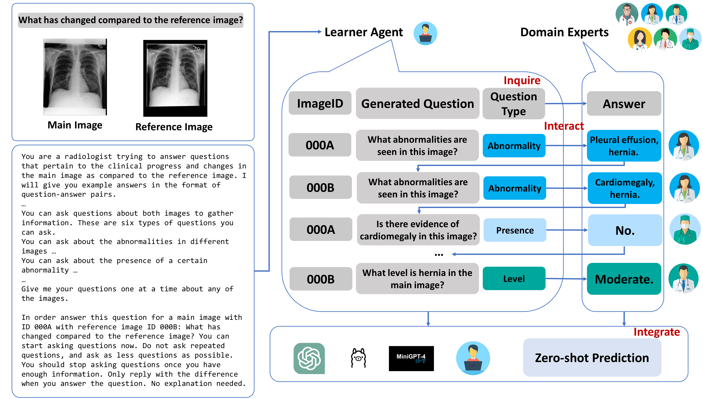

# MultiMedRes  
  
This repository contains source code for the paper [**Inquire, Interact, and Integrate: A Proactive Agent Collaborative Framework for Zero-Shot Multimodal Medical Reasoning**], which is still underreview.  


  
## Abstract  
  
The adoption of large language models (LLMs) in healthcare has attracted significant research interest. However, their performance in healthcare remains under-investigated and potentially limited, due to i) they lack rich domain-specific knowledge and medical reasoning skills; and ii) most state-of-the-art LLMs are unimodal, text-only models that cannot directly process multimodal inputs. To this end, we propose a multimodal medical collaborative reasoning framework **MultiMedRes**, which incorporates a learner agent to proactively gain essential information from domain-specific expert models, to solve medical multimodal reasoning problems. Our method includes three steps: i) **Inquire**: The learner agent first decomposes given complex medical reasoning problems into multiple domain-specific sub-problems; ii) **Interact**: The agent then interacts with domain-specific expert models by repeating the ''ask-answer'' process to progressively obtain different domain-specific knowledge; iii) **Integrate**: The agent finally integrates all the acquired domain-specific knowledge to accurately address the medical reasoning problem. We validate the effectiveness of our method on the task of difference visual question answering for X-ray images. The experiments demonstrate that our zero-shot prediction achieves state-of-the-art performance, and even outperforms the fully supervised methods. Besides, our approach can be incorporated into various LLMs and multimodal LLMs to significantly boost their performance.  
  
  
## Data Preprocessing  
  
We evaluated our framework on the public dataset [MIMIC-Diff-VQA]([https://github.com/Holipori/MIMIC-Diff-VQA/tree/main](https://urldefense.com/v3/__https://github.com/Holipori/MIMIC-Diff-VQA/tree/main__;!!KGKeukY!wBzpFDiYI3E7sS9NabKzFnZN2ieXog9dvy-OdJzeh4RGmEpxwypVSGt5BHlFQGsp835dmy3rClnkAmq42VUZ$)), please refer to their repo and [Physionet]([https://physionet.org/content/medical-diff-vqa/1.0.0/](https://urldefense.com/v3/__https://physionet.org/content/medical-diff-vqa/1.0.0/__;!!KGKeukY!wBzpFDiYI3E7sS9NabKzFnZN2ieXog9dvy-OdJzeh4RGmEpxwypVSGt5BHlFQGsp835dmy3rClnkAhXHSNZC$)) for data access.  

1. **Convert Image** Run the following code to create the PNG images that we are gonna work with.
```python
python data_preprocess/converter.py -p <input_path_to_mimic_cxr_jpg> -o <output_path_to_mimic_cxr_png>
```

2. **Prepare Dataset** Modify line 25-26 in preprocess_data.py in the data_preprocess file, and run the script to generate the training, validation and test data accordingly.
```python
python data_preprocess/preprocess_data.py
```
It will generate the data for each type of questions in src/data.
```bash
├── data
│   ├── data_abnormality
│   │   ├── cache
│   │   │   ├── train_target.pkl
│   │   │   ├── vak_target.pkl
│   │   │   ├── test_target.pkl
│   │   │   ├── trainval_ans2label.pkl
│   │   │   ├── trainval_label2ans.pkl
│   │   ├── glove
│   │   │   ├── glove.6B.300d.txt
│   │   ├── maml
│   │   │   ├── t0_pretrained_maml_pytorch_other_optimization_3shot_newmethod.pth
│   │   │   ├── t1_pretrained_maml_pytorch_other_optimization_3shot_newmethod.pth
│   │   │   ├── t2_pretrained_maml_pytorch_other_optimization_3shot_newmethod.pth
│   │   │   ├── t3_pretrained_maml_pytorch_other_optimization_3shot_newmethod.pth
│   │   │   ├── t4_pretrained_maml_pytorch_other_optimization_3shot_newmethod.pth
│   │   │   ├── t5_pretrained_maml_pytorch_other_optimization_3shot_newmethod.pth
│   │   ├── dictionary.pkl
│   │   ├── embed_tfidf_weights.pkl
│   │   ├── glove6b_init_300d.npy
│   │   ├── imgid2idx.json
│   │   ├── pretrained_ae.pth
│   │   ├── trainset.json
│   │   ├── valset.json
│   │   ├── testset.json
│   ├── data_view
│   ├── data_level
│   ├── data_type
│   ├── data_presence
│   ├── data_location
│   ├── data_all_and_diff
```
  
## Training the Domain Experts  
For each type of questions regarding abnormalities, level, location, type, view, presence, train a seperate domain expert with the following command. It will save the checkpoints in src/save_models, which will be utilized later.
 
```
python main.py --use_VQA --VQA_dir data_level --maml --autoencoder --feat_dim 64 --img_size 84 --maml_model_path pretrained_maml_pytorch_other_optimization_3shot_newmethod.pth --maml_nums 2,5 --model BAN --lr 0.01 --seed 2104 --output saved_models/MMQ_BAN_MEVF_levevl --load
```
We also include the detected abnormalities in save_models, which is the prediction provided by a 121-densenet adapted from [CheXclusion](https://github.com/LalehSeyyed/CheXclusion/tree/main).
  
##   MultiMedRes  Framework
  
Modify line 23 with your openai key and run the bash script if you use.
```
run_demo.sh
```
Or directly run the Python command
```
python demo_mentors_final.py --use_VQA --VQA_dir data_all_with_diff --maml --autoencoder --feat_dim 64 --img_size 84 --maml_model_path pretrained_maml_pytorch_other_optimization_3shot_newmethod.pth --input saved_models/MMQ_BAN_MEVF_all --maml_nums 2,5 --model BAN --epoch _best --batch_size 32 --load --split train
```